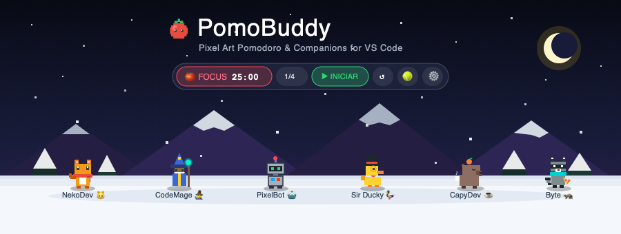

<p align="center">
  
</p>

<p align="center">
  <a href="https://marketplace.visualstudio.com/"></a>
  <a href="https://www.typescriptlang.org/"></a>
  <a href="https://github.com/rgarduno/PomoBuddy/releases"></a>
  <a href="LICENSE"></a>
  <a href="https://github.com/rgarduno/PomoBuddy/pulls"></a>
  <a href="https://github.com/rgarduno/PomoBuddy"></a>
  <a href="https://github.com/rgarduno/PomoBuddy"></a>
</p>

<p align="center">
  <b>English</b> | <a href="README.es.md">Español</a>
</p>

<h1 align="center">🍅 PomoBuddy</h1>

<p align="center">
  <b>Your pixel art productivity and focus companion for Visual Studio Code.</b><br>
  Interactive Pomodoro timer featuring real-time physics, unique companions with distinct personalities, procedural weather-animated stages, break celebrations, and live code diagnostics reactions.
</p>

---

## 🌟 What is PomoBuddy?

**PomoBuddy** re-imagines the traditional Pomodoro technique into a lively, engaging, and rewarding companion experience right inside your editor.

Instead of boring countdown digits or disruptive notification chimes, PomoBuddy introduces **animated pixel art developer companions** that roam freely across your workspace, interact with you through real-time physics, react when linting or syntax errors hit your active file, and celebrate every completed focus milestone.

---

## 🐾 Companion Roster (6 Avatars)

Choose your favorite companion from the **`⚙️ Settings`** menu. Each character features procedural pixel rendering, walk cycles, jump physics, and contextual dialogue:

| Companion | Dev Archetype | Visuals & Animation | Signature Quote |
| :--- | :---: | :--- | :--- |
| **NekoDev** 🐱 | *The Coding Kitty* | Orange fur, red scarf, expressive ears, and a waving tail that bobs rhythmically while walking or resting. | *"Meow! Less scrolling, more coding. 🐾"* |
| **CodeMage** 🧙‍♂️ | *The Archmage of Code* | Midnight blue robe, pointed conical hat, white beard, and an arcane staff topped with a glowing orb. | *"By Merlin's beard! Arcane levitation activated! 🔮"* |
| **PixelBot** 🤖 | *The Retro Terminal AI* | Classic metallic chassis, RGB status antenna, neon green cyber-visor, and articulating mechanical arms. | *"BUILD_SUCCESSFUL: Dopamine levels charged to 100% ⚡"* |
| **Sir Ducky** 🦆 | *Rubber Duck Debugger* | Bright yellow feathers, orange beak, **black top hat**, dark sunglasses, and a red formal bowtie. Signature waddle walk! | *"QUACK! Walk me through your bug line by line, we'll solve it. 🦆✨"* |
| **CapyDev** ☕ | *Zen Anti-Burnout Capybara* | Warm brown tones, serene half-closed eyes, **fresh orange with green leaf on head** (*onsen style*), and a steaming coffee mug. | *"Ok I pull up... Take a deep breath. Code compiles in its own time. ☕"* |
| **Byte** 🦝 | *The Midnight Hacker* | Slate gray fur, **black bandit eye mask**, electric cyan hoodie, striped tail, and a slice of **pizza** 🍕 during breaks. | *"Stealth jump for midnight snacks! Hacking the mainframe... 🦝"* |

---

## 🌄 5 Thematic Stages with Animated Weather

Tailor the world your companion lives in with atmospheric lighting and dynamic particle systems:

* ❄️ **Snowy Winter (Default):** Star-filled midnight sky, purple mountain ranges with snow caps, evergreen pines, and a gentle blizzard of falling snowflakes.
* 🌲 **Enchanted Forest:** Moonlit emerald hills, lush oak trees, and golden fireflies drifting through the night.
* 🌆 **Cyberpunk Synthwave:** Towering skyscraper skyline, neon-lit horizon, wet asphalt pavement with reflections, and diagonal digital rain.
* ☕ **Lo-Fi Café:** Warm sunset window view, hanging fairy lights, wooden bookshelf with succulents, and golden dust motes floating in sunlight.
* ⬛ **Minimalist Zen:** Pure transparent backdrop seamlessly blending into any light, dark, or high-contrast VS Code theme.

---

## 🚀 Key UX & Engineering Features

### 1. 🎾 Interactive Physics Toy (Rebound Ball)
Click the **`🎾`** button on the HUD or tap anywhere on the stage floor to toss a pixel art tennis ball simulated with **gravity, bounce elasticity, and friction**. Your companion will eagerly sprint toward the ball, **kick it into the air, perform an acrobatic jump, and celebrate**.

### 2. 🖥️ Intelligent Dual Display (Sidebar + Bottom Panel)
* **Sidebar Mode:** Compact, cozy view that accompanies your files discretely.
* **Panoramic Bottom Panel:** Placed alongside your Terminal & Output tabs, stretching across **100% of your display width** for a sprawling playground.
* **1-Click Seamless Switch:** Toggle between views in Settings; PomoBuddy automatically closes the opposing view to avoid duplicate panels.

### 3. ⏱️ Minimal Frosted Glass Floating HUD
A modern floating pill crafted in translucent frosted glass (`backdrop-filter: blur(10px)`) that hovers unobtrusively over the scene:
`[ 🍅 FOCUS 24:50  1/4 ] [ ▶ Start ] [ ↺ ] [ ⏭ ] [ 🎾 ] [ ⚙️ ]`

### 4. 😵‍💫 Real-Time IDE Diagnostics Reactions
Tied directly into the VS Code Diagnostics API (`vscode.languages.onDidChangeDiagnostics`):
* If syntax or linter errors appear in your active file, your companion shows concern or gets dizzy.
* Resolving the issues or saving your work (`Cmd+S` / `Ctrl+S`) triggers an enthusiastic thumbs-up with sparkle particles.

### 5. 🔊 Procedural 8-Bit Retro Audio & Sound Packs
Synthesized on-the-fly using the native **Web Audio API**:
* **3 Curated Sound Packs:** Switch seamlessly between **Arcade 👾** (authentic chiptune bleeps), **Zen 🧘‍♂️** (calming harmonic Tibetan bowl chimes with soft exponential decay), and **Cyber 🌆** (punchy synthwave tones).
* **0 KB of external audio files** (zero MP3/WAV dependencies, instant loading).
* Zero latency, fully offline, and accompanied by a quick mute shortcut (`pomobuddy.toggleMute`) for Zoom/Meet calls.

### 6. 📊 Productivity Stats Dashboard & Daily Streak Tracker
Track your deep focus momentum right inside the companion settings:
* **Today's Focus Metrics:** Instant view of completed Pomodoros and accumulated minutes of Deep Work.
* **Daily Streak Counter:** Keeps you motivated to maintain a consistent daily coding routine.
* **7-Day Focus Bar Chart:** High-contrast visual mini-bars displaying your daily output over the last week.
* **Persistent & Privacy-First:** Data stays 100% local inside your VS Code storage (`globalState`), with a 1-click reset option.

### 7. 🐾 Dynamic Companion Mini-Avatar in Status Bar
Never lose track of your buddy even with panels minimized:
* Shows your active companion's live emoji (`🐱`, `🧙‍♂️`, `🤖`, `🦆`, `☕`, `🦝`) alongside remaining time, round counter, and state icons.
* Click the status bar anytime to instantly bring PomoBuddy to the foreground.

### 8. 🛡️ Sleep Mode Resilient Delta Clock
Unlike naive timers relying on continuous `setInterval` ticks, PomoBuddy computes time remaining using **system clock delta timestamps** (`targetEndTime = Date.now() + delta`). When your laptop lid closes or enters sleep mode, the timer resumes with mathematical precision upon wake-up.

---

## 🏛️ Technical Architecture

```
┌────────────────────────────────────────────────────────┐
│             VS Code Extension Host (Node.js)           │
│                                                        │
│   extension.ts ──► timerManager.ts (Delta Clock/Stats) │
│        ▲                   │                           │
│        │                   ▼                           │
│   ideEvents.ts     pomoWebviewProvider.ts              │
│  (Diagnostics/IO)          │                           │
│        │                   │                           │
│        ▼                   ▼                           │
│   statusBarManager.ts (Live Avatar Status)             │
└────────────────────────────┼───────────────────────────┘
                             ▼ Typed PostMessage Protocol
┌────────────────────────────────────────────────────────┐
│             Webview Context (HTML5 / Canvas 2D)        │
│                                                        │
│   • Procedural Pixel Renderer (60 FPS Game Loop)       │
│   • Physics Engine (Gravity, Bounces, Collision)       │
│   • Weather Particle System (Snow, Fireflies, Rain)    │
│   • Web Audio API Synthesizer (Arcade, Zen, Cyber)     │
│   • Frosted Glass Responsive HUD & Stats Dashboard     │
└────────────────────────────────────────────────────────┘
```

* **Core Language:** Strict TypeScript 5.3+ bundled with high-speed `esbuild`.
* **Lightweight Footprint:** Entire packaged extension is under **60 KB** (no heavy runtime bloat).
* **State Persistence:** Reliable session recovery and streak tracking via `vscode.Memento` (`globalState`).

---

## 🧪 Unit Testing Suite (Jest)

PomoBuddy includes an automated test suite verifying state machine integrity, delta math, sleep-mode recovery, streak tracking, and UI formatting:

```bash
# Run unit tests
npm test

# Generate code coverage report
npm run test:coverage
```

- **26 Unit Tests across 2 Suites** (`timerManager.test.ts`, `statusBarManager.test.ts`).
- Lightweight VS Code API mocks (`tests/__mocks__/vscode.ts`) execute tests in **~1.8 seconds**.
- **>83% line coverage** and **>97% function coverage** across core timing and status bar logic.

---

## 📦 Installation & Setup

### Install via VSIX

1. Download the latest [`pomobuddy-0.1.0.vsix`](https://github.com/rgarduno/PomoBuddy/releases) package.
2. Open the Command Palette in VS Code (`Cmd+Shift+P` on macOS / `Ctrl+Shift+P` on Windows & Linux).
3. Search and select: **`Extensions: Install from VSIX...`**
4. Choose `pomobuddy-0.1.0.vsix`.
5. Click the tomato icon 🍅 on the left Activity Bar or the bottom PomoBuddy panel.

### Local Development & Build

```bash
# 1. Clone the repository
git clone https://github.com/rgarduno/PomoBuddy.git
cd PomoBuddy

# 2. Install build dependencies
npm install

# 3. Compile TypeScript
npm run compile

# 4. Run Jest test suite
npm test

# 5. Package into .vsix extension
npm run package
```

---

## ⚙️ Custom Configuration

Customize your settings through the in-extension `⚙️ Settings` modal or directly in `settings.json`:

```json
{
  "pomobuddy.workDuration": 25,
  "pomobuddy.shortBreakDuration": 5,
  "pomobuddy.longBreakDuration": 15,
  "pomobuddy.roundsBeforeLongBreak": 4,
  "pomobuddy.soundEnabled": true,
  "pomobuddy.avatar": "duck",
  "pomobuddy.background": "winter"
}
```

---

## ⌨️ Available Commands

| Command Title | Command ID | Description |
| :--- | :--- | :--- |
| **Start Timer** | `pomobuddy.start` | Start or resume countdown |
| **Pause Timer** | `pomobuddy.pause` | Pause the active session |
| **Reset Timer** | `pomobuddy.reset` | Reset current interval |
| **Skip Interval** | `pomobuddy.skip` | Immediately jump to the next interval |
| **Mute / Unmute Audio** | `pomobuddy.toggleMute` | Toggle 8-bit sound synthesizer |
| **Open in Sidebar** | `pomobuddy.openCompanion` | Focus companion in the left sidebar |
| **Open in Bottom Panel** | `pomobuddy.openBottomPanel` | Focus companion in panoramic bottom panel |

---

## 🤝 Contributing

Contributions, issues, and feature requests are welcome! If you want to design a new pixel art companion, create ambient themes, or add sound packs, please read our comprehensive **[Contribution Guide (CONTRIBUTING.md)](CONTRIBUTING.md)** for canvas coordinate systems, emotional moods, and step-by-step code integration.

1. Fork the project.
2. Create your feature branch (`git checkout -b feature/NewCompanion`).
3. Commit your changes (`git commit -m 'feat(avatar): add new companion'`).
4. Push to the branch (`git push origin feature/NewCompanion`).
5. Open a Pull Request.

---

## 📄 License

Distributed under the **MIT License**. See [LICENSE](LICENSE) for more details.

**Crafted with dedication by [Rafael Alejandro](https://github.com/rgarduno)** 🚀
